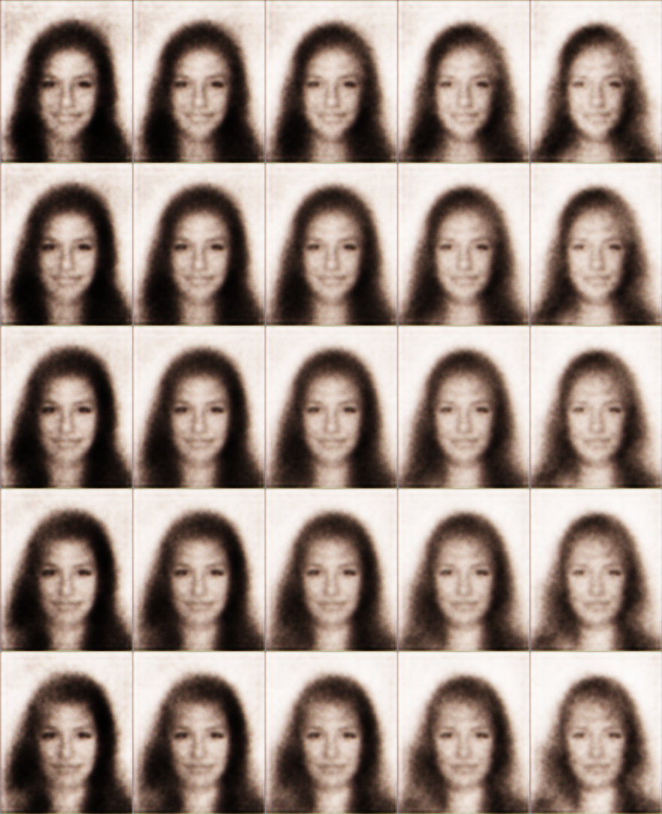
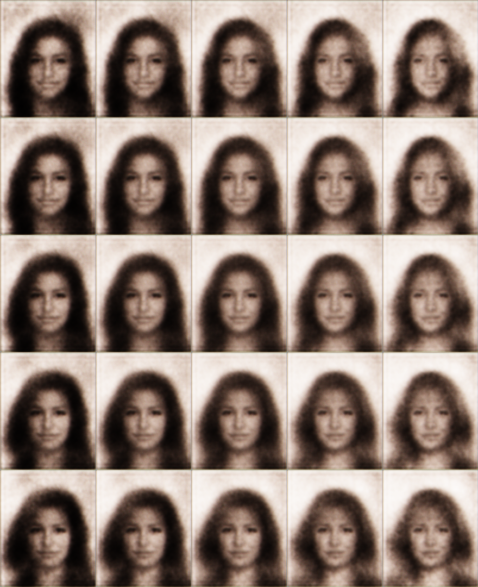
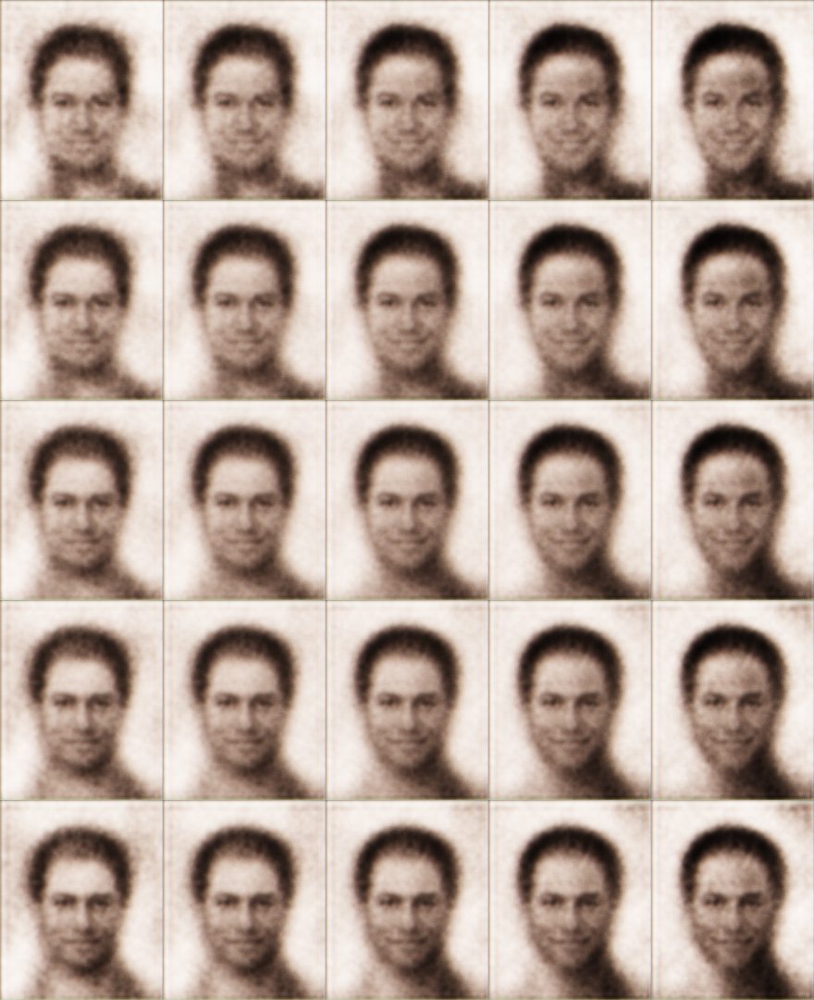
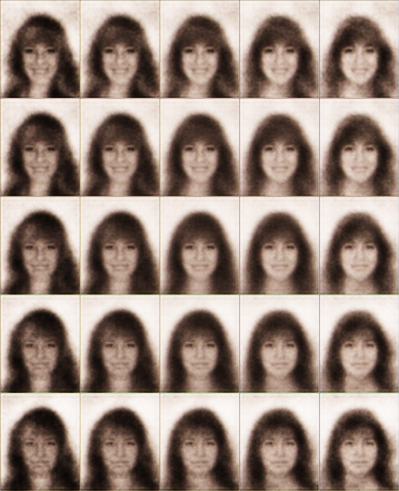

# NumPyro implementation of _β_-VAE

## Setup

If you are using Google Colab TPU, you need to copy the content of `colab-utils/setup_colab_tpu.py` to the Notebook cell and run before running other code. If you are using Google Cloud TPU, you do not need to do this step.

Install prerequisites:

```sh
pip install "jax[tpu]==0.3.1" -f https://storage.googleapis.com/jax-releases/libtpu_releases.html
pip install -r requirements.txt
```

Prepare data:

```sh
./prepare_data.sh
```

## The Chairs dataset

Train:

```sh
python train.py
```

Latent space traversal:

```sh
python traverse_chairs.py
```

## The CelebA dataset

The code for the CelebA dataset is on the [`celeba`](https://github.com/ayaka14732/beta-vae-numpyro/tree/celeba) branch.

## Generate 2D-shape dataset

The code for generating the 2D-shape dataset is in the `shape-data-gen` directory.

## Disentanglement metric

The code for verifying the disentanglement metric is in the `disentanglement-metric` directory.

## Sample results








